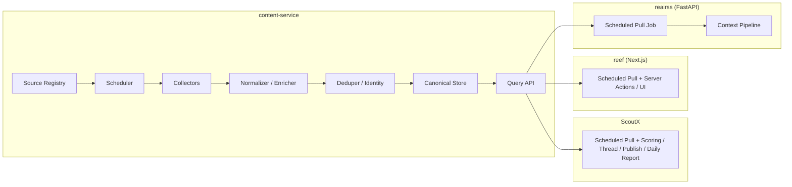
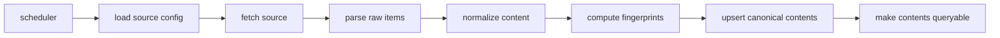

# Content Service 详细设计

## 1. 文档目的

本文用于定义一个可逻辑独立、后续可单独部署的 `content-service`，作为 ScoutX、reef、reairss 共享的内容订阅中心。目标是统一内容采集、标准化、去重和查询能力，避免每个项目各自维护一套内容订阅模块。

本文重点回答以下问题：

- 为什么需要拆出独立内容服务
- 服务边界应该放在哪里
- ScoutX、reef、reairss 应该如何接入
- API 和数据模型如何设计
- 如何从当前 ScoutX 渐进式迁移

## 2. 背景与问题

当前 ScoutX 已经具备内容采集链路：

1. 采集 RSS / HTML source
2. 清洗 HTML 和图片
3. 关键词过滤
4. 去重
5. 可选 LLM 打分
6. 可选生成推文串
7. 入库和日报展示
8. 飞书通知与发布

这个实现适合单项目快速迭代，但不适合作为多个独立仓库共享的长期底座，原因如下：

- `reef` 是 Next.js，无法直接共享 Python 模块
- `reairss` 是独立 FastAPI 仓库，即使同为 Python，也不适合直接依赖 ScoutX 内部实现
- 当前 ScoutX 中“采集”和“业务动作”耦合过深，公共能力和业务能力边界不清
- 多项目独立演进时，共享代码包的版本兼容、发版、回滚成本高于共享服务

因此，本设计选择将“内容订阅底座”抽成独立服务边界，而不是继续做“各项目各自内嵌内容采集模块”。在实施上，第一阶段可以先与 ScoutX 同仓开发、同环境测试和部署，只要求目录结构、模块边界和接口契约先分开，后续再按需要演进到独立部署。

## 3. 设计目标

### 3.1 Goals

- 提供统一的内容源接入能力，支持 RSS、HTML，后续可扩展 API 型 source
- 提供统一的标准化内容模型，屏蔽 source 差异
- 提供统一去重与 canonical content identity
- 提供统一查询 API，供多个独立应用消费
- 支持灰度迁移，尽量复用当前 ScoutX 中已有采集逻辑

### 3.2 Non-goals

- 不负责 ScoutX 的 AI 打分、摘要、推文串生成
- 不负责飞书日报和 X 发布
- 不负责 reef 的页面展示逻辑
- 不负责 reairss 的 context 拼装、embedding、索引策略
- 不做“大中台工作台 UI”作为第一阶段目标
- 不在第一阶段引入复杂消息队列系统
- 不把 webhook 作为 MVP 必需能力

## 4. 总体原则

只有一条主原则：

`content-service` 只回答“世界上新出现了什么内容”，各业务系统自己决定“要不要用、怎么用”。

具体落地为：

- 公共层只做内容事实管理
- 业务层自己管理业务状态和业务决策
- 同一条内容可被多个应用以不同方式消费

例如同一条内容：

- ScoutX 可以标记为 `picked_for_thread`
- reef 可以标记为 `visible_on_homepage`
- reairss 可以标记为 `indexed_for_context`

这些状态不应保存在 `content-service` 的 canonical content 表中，而应由各应用自行维护。

## 5. 系统边界

### 5.1 `content-service` 负责什么

- source registry
- source validation
- source scheduler
- collector execution
- normalization / enrichment
- deduplication / canonical identity
- canonical storage
- query API
- source run / delivery audit log

### 5.2 `content-service` 不负责什么

- 内容选题逻辑
- AI prompt 与模型选择
- 推文串生成
- 发布到飞书 / X / Typefully
- 下游展示和交互 UI
- 下游应用的业务审核状态

## 6. 架构概览



## 7. 与三个应用的接入方式

### 7.0 接入模式总览

| 应用 | 推荐主模式 | 是否需要 Webhook | 是否需要定时增量 Pull | 说明 |
| --- | --- | --- | --- | --- |
| `ScoutX` | Pull API | 不需要 | 需要 | 更像批处理内容加工链路，需自己控制 AI 和发布节奏 |
| `reef` | 定时 Pull API | 不需要 | 需要 | 展示型应用，后台定时同步成本最低、效果足够 |
| `reairss` | 定时 Pull API | 不需要 | 需要 | FastAPI 后端也可以先用定时增量同步，复杂度最低 |

### 7.1 ScoutX

建议以 `pull API` 为主。

原因：

- ScoutX 当前更像批处理内容加工链路
- 它有 LLM 和发布动作，需要自己控制处理节奏
- 不一定要求“内容一到就立刻处理”

推荐方式：

- 每 5 分钟或 10 分钟调用 `GET /v1/contents`
- 按条件拉取新内容
- 在本地执行 AI 打分、摘要、发布、日报

### 7.2 reef

建议以 `后台定时任务 + pull API` 为主。

原因：

- reef 是 Next.js 展示型应用
- 它更关心“当前有哪些内容可展示”
- 对于页面渲染场景，pull 配合缓存、ISR、服务端定时同步更自然
- 相比 webhook，实现成本更低，调试更直接，效果通常已经足够

推荐方式：

1. 通过平台 cron、系统 cron 或独立 worker 定时触发同步任务
2. reef 的 sync job 调用 `GET /v1/contents?updated_since=...`
3. 将结果写入 reef 本地数据库或缓存
4. 页面读取 reef 本地数据，而不是每次直接打 `content-service`

补充说明：

- 不建议优先在 Next.js 应用进程内部用常驻 `setInterval` 做调度
- 更稳的方式是使用外部调度器触发同步任务
- 这样可以避免多实例重复执行、重启丢调度和 serverless 兼容问题

### 7.3 reairss

第一阶段建议与 ScoutX、reef 统一，采用 `后台定时任务 + pull API`。

原因：

- 当前阶段优先降低实现和联调复杂度
- reairss 虽然适合后续做事件驱动，但这不是 MVP 必需能力
- 用 `updated_since` 增量拉取已经足够支撑大多数上下文同步场景

推荐方式：

1. reairss 定时调用 `GET /v1/contents?updated_since=...`
2. 将拉到的内容写入本地内容表或直接进入 context pipeline
3. 失败时下次继续补拉

结论：

- `API 是真相源`
- 第一阶段三个应用统一采用 `scheduled pull`

## 8. 核心领域模型

### 8.1 Canonical Content

`content-service` 中的 canonical content 表示“去重后的统一内容对象”，建议包含以下字段：

| 字段 | 说明 |
| --- | --- |
| `content_id` | 系统内部稳定唯一 ID |
| `canonical_url` | 归一化后的主 URL |
| `title` | 标题 |
| `summary_text` | 清洗后的摘要或正文摘要 |
| `body_text` | 可选，抽取到的正文纯文本 |
| `published_at` | 原始发布时间 |
| `discovered_at` | 首次被系统发现的时间 |
| `updated_at` | 最后更新时间 |
| `language` | 语言 |
| `authors_json` | 作者列表 |
| `tags_json` | 基础标签 |
| `media_json` | 媒体列表 |
| `source_count` | 被多少个 source 命中 |
| `raw_score` | 可选，非业务专属基础质量分 |

### 8.2 Raw Item

`raw_item` 表示某个 source 某次采集到的原始记录，用于追踪与重放，不直接暴露给业务方。

### 8.3 Source

`source` 表示采集源定义，支持：

- `rss`
- `html`
- 未来可扩展 `api`

### 8.4 Consumer

第一阶段不强制引入完整多租户模型，但设计上允许把下游应用抽象为 `consumer`：

- `scoutx`
- `reef`
- `reairss`

这主要用于审计和访问控制，不用于存储业务状态。

## 9. 数据流设计

### 9.1 采集主流程



### 9.2 处理说明

1. 调度器读取启用中的 source
2. 执行单 source 抓取
3. 解析成 raw items
4. 标准化字段与 URL
5. 计算去重指纹
6. 创建或更新 canonical content
7. 若有内容新增或发生有效更新，则更新 `updated_at`
8. 下游应用在自己的定时任务中按 `updated_since` 增量拉取

## 10. 标准化与去重策略

### 10.1 URL 归一化

建议至少做以下处理：

- 去掉常见 tracking query 参数，如 `utm_*`
- 去掉 fragment
- 统一协议和 host 大小写
- 可选保留必须 query 参数

### 10.2 去重指纹

第一阶段建议采用组合策略：

- `url_fingerprint`: 基于 canonical URL
- `title_fingerprint`: 基于归一化标题
- `content_fingerprint`: 基于摘要或正文片段

判重规则：

- canonical URL 相同，视为同一内容
- 若 URL 不同但标题高度一致，可进入候选合并
- 第一阶段以保守去重为主，避免误合并

### 10.3 标准化内容提取

RSS source：

- 标题
- 链接
- summary / description
- enclosure media
- published / updated time

HTML source：

- 通过 `list_selector + fields` 提取
- 支持 title / url / description / comments / media

## 11. API 设计

### 11.1 `GET /health`

用途：

- 存活探针
- 依赖项健康状态检查

响应示例：

```json
{
  "ok": true,
  "service": "content-service",
  "time": "2026-03-24T12:00:00Z"
}
```

### 11.2 `GET /v1/contents`

用途：

- 拉取内容列表
- 供 ScoutX、reef、reairss 补偿同步使用

查询参数建议：

- `source`
- `updated_since`
- `published_since`
- `limit`
- `cursor`
- `tag`

响应示例：

```json
{
  "items": [
    {
      "content_id": "cnt_123",
      "title": "Example title",
      "canonical_url": "https://example.com/a",
      "summary_text": "summary",
      "published_at": "2026-03-24T11:00:00Z",
      "updated_at": "2026-03-24T11:05:00Z",
      "sources": ["qbitai_rss"]
    }
  ],
  "next_cursor": "opaque_cursor"
}
```

### 11.3 `GET /v1/contents/{content_id}`

用途：

- 查询单条内容详情
- 查询单条内容详情

### 11.4 `GET /v1/sources`

用途：

- 查看 source 列表和当前状态

返回信息建议：

- `source_id`
- `name`
- `type`
- `enabled`
- `schedule`
- `last_run_at`
- `last_status`
- `last_error`

### 11.5 `POST /v1/sources/validate`

用途：

- 校验 source 配置是否可用
- 可替代当前 `validate_sources.py` 的主要能力

请求示例：

```json
{
  "type": "rss",
  "name": "jiqizhixin_rss",
  "url": "https://www.jiqizhixin.com/rss"
}
```

## 12. 存储设计

建议使用 PostgreSQL，而不是延续 SQLite。

原因：

- 独立服务需要更稳定的并发写入
- 便于未来支持更多 source 和更复杂的同步场景
- 更利于后续做分页、索引和管理查询

### 13.1 `sources`

```sql
CREATE TABLE sources (
  id UUID PRIMARY KEY,
  name TEXT NOT NULL UNIQUE,
  type TEXT NOT NULL,
  config_json JSONB NOT NULL,
  enabled BOOLEAN NOT NULL DEFAULT TRUE,
  schedule_expr TEXT NOT NULL,
  created_at TIMESTAMPTZ NOT NULL DEFAULT NOW(),
  updated_at TIMESTAMPTZ NOT NULL DEFAULT NOW()
);
```

### 13.2 `source_runs`

```sql
CREATE TABLE source_runs (
  id UUID PRIMARY KEY,
  source_id UUID NOT NULL REFERENCES sources(id),
  status TEXT NOT NULL,
  fetched_count INT NOT NULL DEFAULT 0,
  normalized_count INT NOT NULL DEFAULT 0,
  created_count INT NOT NULL DEFAULT 0,
  updated_count INT NOT NULL DEFAULT 0,
  started_at TIMESTAMPTZ NOT NULL,
  finished_at TIMESTAMPTZ,
  error_message TEXT
);
```

### 13.3 `raw_items`

```sql
CREATE TABLE raw_items (
  id UUID PRIMARY KEY,
  source_id UUID NOT NULL REFERENCES sources(id),
  source_run_id UUID NOT NULL REFERENCES source_runs(id),
  external_id TEXT,
  raw_url TEXT,
  raw_title TEXT,
  raw_payload_json JSONB NOT NULL,
  fetched_at TIMESTAMPTZ NOT NULL DEFAULT NOW()
);
```

### 13.4 `contents`

```sql
CREATE TABLE contents (
  id UUID PRIMARY KEY,
  content_key TEXT NOT NULL UNIQUE,
  canonical_url TEXT NOT NULL,
  title TEXT NOT NULL,
  summary_text TEXT NOT NULL DEFAULT '',
  body_text TEXT NOT NULL DEFAULT '',
  published_at TIMESTAMPTZ,
  discovered_at TIMESTAMPTZ NOT NULL DEFAULT NOW(),
  updated_at TIMESTAMPTZ NOT NULL DEFAULT NOW(),
  language TEXT,
  authors_json JSONB NOT NULL DEFAULT '[]'::jsonb,
  tags_json JSONB NOT NULL DEFAULT '[]'::jsonb,
  media_json JSONB NOT NULL DEFAULT '[]'::jsonb,
  source_count INT NOT NULL DEFAULT 1
);
```

### 13.5 `content_sources`

```sql
CREATE TABLE content_sources (
  content_id UUID NOT NULL REFERENCES contents(id),
  source_id UUID NOT NULL REFERENCES sources(id),
  raw_item_id UUID NOT NULL REFERENCES raw_items(id),
  discovered_at TIMESTAMPTZ NOT NULL DEFAULT NOW(),
  PRIMARY KEY (content_id, raw_item_id)
);
```

## 13. 调度与执行模型

第一阶段建议采用简单稳定方案：

- 单独 scheduler 进程
- 定期扫描可执行 source
- 逐个 source 执行
- 每个 source 的错误不影响整个调度循环

不建议第一阶段就引入：

- 分布式任务队列
- Kafka / Pulsar
- 复杂 worker 池

如果后续 source 数量显著增长，再考虑：

- source 并发抓取
- 面向消费者的增量游标或同步检查点
- 基于队列的事件投递

## 14. 安全与可靠性

### 15.1 API 访问

- 服务间调用使用内部网络
- 通过 service token 或 API key 做鉴权
- `reef` / `reairss` / `ScoutX` 各自分配调用凭证

### 14.2 幂等

- 下游同步任务应按 `content_id` 做 upsert
- 下游应保存自己的同步检查点，如 `last_synced_at`

### 14.3 回放能力

- 所有消费者都可通过 API 重新拉取历史内容
- 失败同步可通过 `updated_since` 补偿

## 15. 部署建议

第一阶段建议采用“同仓开发、同环境部署、逻辑分层”的模式：

1. `content-service` 代码仍放在 ScoutX 仓库内
2. 目录、配置、接口、存储层与 ScoutX 业务逻辑明确分开
3. 开发、测试、预发环境可与 ScoutX 一起启动和联调
4. 等接口稳定后，再视情况拆独立仓库或独立部署

这样做的好处：

- 本地联调和测试成本更低
- 迁移时可以最大化复用当前 ScoutX 代码
- 能先验证边界和协议，而不是先承担仓库/部署拆分成本

第二阶段再考虑拆成最少两个进程：

1. `content-service-api`
- 提供 HTTP API

2. `content-service-scheduler`
- 执行 source 调度、采集、标准化和入库

第一阶段如果规模不大，也可以直接和 ScoutX 进程一起编排或同机部署，但代码结构上仍应按 `content-service-api`、`scheduler` 的职责拆模块。

## 16. 从当前 ScoutX 的迁移方案

### 17.1 当前 ScoutX 可复用部分

当前 ScoutX 中适合迁移到 `content-service` 的能力：

- source config schema
- RSS collector
- HTML collector
- HTML media extraction / text normalization
- 基础 dedup
- source validation 逻辑

不应迁移到 `content-service` 的能力：

- AI 相关逻辑
- 推文串生成
- 发布器
- 飞书通知
- Web 报表展示

### 17.2 迁移阶段建议

#### Phase 1: 逻辑拆分

在现有 ScoutX 中先明确模块边界：

- `collector`
- `normalizer`
- `dedup`
- `content store`
- `scoutx app logic`

#### Phase 2: 服务化边界固化

继续在当前仓库内固化 `content-service` 目录边界，先迁移：

- source schema
- collector
- extractor
- dedup
- validation

#### Phase 3: ScoutX 改为消费者

ScoutX 不再直接采集 source，而是：

- 调 `GET /v1/contents`
- 处理内容筛选和发布逻辑

#### Phase 4: 接入 reef

reef 通过服务端 API 拉取内容用于展示或二次加工。

#### Phase 5: 接入 reairss

reairss 增加：

- 定时 sync job
- 同步检查点
- content upsert pipeline

## 17. MVP 范围

第一版必须完成：

- RSS / HTML source 采集
- PostgreSQL 存储
- canonical contents 模型
- 基础去重
- `GET /v1/contents`
- `GET /v1/contents/{content_id}`
- `GET /v1/sources`
- `POST /v1/sources/validate`
- 下游按 `updated_since` 的增量 pull 模式

第一版不做：

- 管理后台 UI
- 复杂标签体系
- 多租户权限系统
- 复杂全文搜索
- 队列化事件总线

第二阶段可选能力：

- webhook 事件推送
- webhook delivery audit
- dispatcher

## 18. 风险与注意事项

### 19.1 最大风险

最大的风险不是技术实现，而是边界失控。

如果后续把以下逻辑不断加回 `content-service`：

- AI 打分
- 业务过滤
- 发布动作
- 应用状态

那么 `content-service` 会重新膨胀成一个“大而全单体”，失去设计初衷。

### 19.2 第二个风险

过早复杂化。

如果第一阶段就引入：

- MQ
- 多 worker 分布式调度
- 管理后台
- 多租户复杂权限

开发周期会明显拉长，且无法快速验证是否真的服务于三个项目。

## 19. 待确认问题

以下问题建议在正式开发前确认：

1. `content-service` 第一阶段是否仅做同仓目录拆分
2. 服务部署环境是单机 Docker 还是 Kubernetes
3. 第一期 source 数量和抓取频率预估
4. `contents` 是否需要保存全文正文
5. 是否需要对 source 配置提供只读管理接口
6. 是否要求 `reef` 本地落库，还是直接透传展示
7. `reairss` 的同步频率和幂等表结构
8. webhook 是否在第二阶段再引入

## 20. 结论

对于当前的系统现状和仓库组织方式，最合理的方向不是“在三个项目里复用一个内容模块”，而是建设一个独立的 `content-service`。

它的角色应该是：

- 内容事实源
- 统一采集与标准化服务
- 统一分发入口

而不是：

- 统一业务流程中台
- 统一 AI 加工平台
- 统一运营后台

最终关系应为：

- `content-service` 提供统一内容底座
- `ScoutX`、`reef`、`reairss` 平级消费它
- `API` 作为真相源
- 第一阶段三个应用统一采用 `scheduled pull`
- `Webhook` 留作后续可选优化

这个架构既能满足复用，也能避免过度耦合，适合作为后续开发与评审基线。
