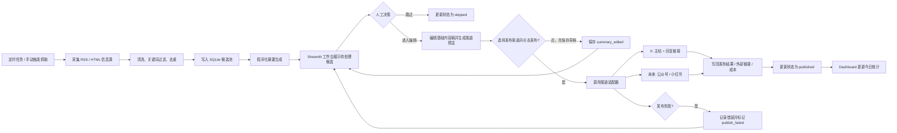
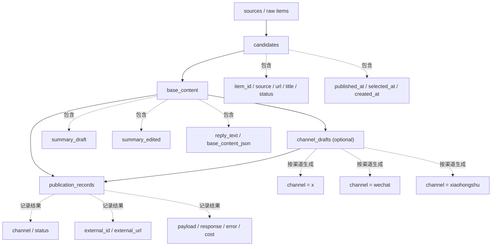

# ScoutX 二期产品需求文档（PRD）

## 1. 文档信息

- 产品名称：ScoutX 二期
- 文档类型：PRD
- 当前版本：v0.1 Draft
- 更新时间：2026-03-24
- 适用范围：ScoutX 内容采集与半自动发布工作台

## 2. 背景

ScoutX 一期已经具备以下能力：

- 定时采集 RSS / HTML 信息源
- 进行基础清洗、去重、关键词过滤
- 可选调用 LLM 打分与生成线程内容
- 落库日报并提供只读 Web 页面展示
- 可选发布到 X / Typefully

现阶段系统更偏向“自动采集 + 自动生成 + 自动发布/展示”的批处理流水线，但实际使用中，内容运营更需要“人工选题、人工把关、快速编辑、手动发布”的工作方式。尤其是在中文 AI 资讯场景下，自动生成内容虽然能提升效率，但直接决定发布内容仍有风险，包含：

- 标题党或低价值新闻被误选
- 自动生成摘要风格不稳定
- 账号发布需要更强的人为控制
- 发布成本和频次需要可视化管理

因此，ScoutX 二期目标是将项目升级为“半自动内容运营工作台”，让系统负责抓取、入池、规则摘要和发布辅助，让运营人员负责最后的筛选、编辑和发布决策。

## 3. 产品目标

### 3.1 核心目标

构建一个可日常使用的 AI 头条发布工作台，形成如下工作流：

`定时抓取 -> 候选入池 -> 人工筛选 -> 程序化摘要 -> 人工编辑 -> 手动发布到 X`

同时，二期整体设计需以“可扩展到多发布渠道”为前提，保证后续可以在不重构核心流程的情况下扩展到微信公众号、小红书等平台。

### 3.2 目标收益

- 将每日内容筛选与发布时间从约 1 到 2 小时压缩到 15 到 30 分钟
- 将自动发布改为“人工确认后发布”，降低错误发布风险
- 建立可追踪的候选池、编辑稿和发布记录
- 在不依赖 AI 的前提下先跑通二期主流程，控制成本并提升稳定性
- 为后续扩展微信公众号、小红书等渠道预留统一发布抽象

### 3.3 非目标

以下内容不在二期范围内：

- 多用户权限系统
- 复杂审核流或协同评论系统
- 全量替换现有 `web_server.py` 日报展示页
- 引入 PostgreSQL、Redis 等新基础设施
- 自动生成长文、自动配图、自动跨平台一键分发
- 强依赖 AI 生成摘要作为主路径

## 4. 目标用户

### 4.1 核心用户

- 内容运营者
- AI 资讯筛选者
- 个人账号或品牌账号维护者

### 4.2 用户特征

- 需要快速浏览大量中文 AI 资讯
- 对内容质量、选题角度和发布节奏有主观判断
- 可以接受“半自动”，不接受“全自动失控”
- 希望工具简单、可本地运行、成本低

## 5. 关键问题

当前流程主要存在以下问题：

1. 系统偏批处理，缺少人工运营入口。
2. 当前日报展示页只适合回看，不适合筛选、编辑、发布。
3. 内容是否发布、为什么发布、发布过没有，缺少统一工作台视图。
4. 摘要生成路径过于依赖 LLM，不利于稳定性和成本控制。
5. 发布动作虽然已有能力，但与候选筛选、内容编辑没有串成一个闭环。
6. 当前发布能力以 X 为中心，缺少面向多平台扩展的统一抽象。

## 6. 产品方案概述

二期新增一个基于 Streamlit 的“内容发布工作台”，并在现有 SQLite 数据存储上扩展候选状态与摘要草稿字段。

整体方案如下：

1. 保留现有采集与去重管线，继续由 `main.py` 定时执行。
2. 抓取到的新内容不直接进入“日报即结果”的单一路径，而是进入“候选池”。
3. 系统对候选条目自动生成程序化摘要草稿，不依赖 LLM。
4. 运营人员在 Streamlit 工作台中浏览候选、跳过不相关内容、编辑摘要、预览发布效果。
5. 发布层采用“统一发布接口 + 渠道适配器”设计，二期先落地 X，后续可扩展微信公众号、小红书。
6. 点击发布后，由目标渠道适配器执行对应发布流程；X 先实现主帖 + 回复链接的二段式发布。
7. 发布完成后，状态回写 SQLite，并按渠道维度统计发布次数、结果与预估成本。

### 6.1 扩展性设计原则

- 采集、摘要、编辑、发布四层解耦，避免渠道能力反向污染前置流程。
- “内容稿件”与“渠道发布结果”分离存储，同一候选内容未来可投递到多个渠道。
- 基础稿定义为平台无关内容，只维护一份主编辑稿；各渠道在发布前基于基础稿做转换，不反向覆盖基础稿。
- 每个发布渠道通过统一接口接入，最小包含：
  - 渠道标识
  - 内容校验
  - 预览转换
  - 发布执行
  - 发布结果回写
- 工作台中的编辑区应区分“基础内容稿”和“渠道预览稿”，避免未来公众号长文、小红书图文与 X 短帖互相耦合。
- 二期虽然只交付 X 的真实发布，但数据模型、服务层和 UI 结构要允许后续增加“选择发布渠道”的入口。

### 6.2 整体流程图

## 7. 核心功能需求

### 7.1 候选池管理

#### 功能说明

系统需要提供“待处理内容池”，用于承接抓取到但尚未决定是否发布的内容。

#### 功能要求

- 展示状态为“待处理”的候选条目
- 每条展示基础信息：
  - 标题
  - 来源
  - 发布时间
  - 原始链接
  - 摘要草稿
  - 当前状态
- 支持以下操作：
  - 选中进入摘要编辑
  - 标记跳过
  - 查看原文
  - 按来源筛选
  - 按状态筛选
  - 按日期查看

#### 状态定义

- `pending`：待处理
- `selected`：已选中待编辑
- `skipped`：已跳过
- `published`：已发布
- `publish_failed`：发布失败

说明：如实现时希望减少状态复杂度，可在第一版中先保留 `pending / skipped / published / publish_failed` 四个状态。

### 7.2 程序化摘要生成

#### 功能说明

系统在候选条目入池后，自动生成一版“可编辑摘要草稿”。

#### 设计原则

- 默认不依赖 AI
- 输出风格尽量稳定、简短、适合 X 首帖
- 结果可被人工直接修改

#### 输入来源

- `title`
- `description`
- 页面正文抓取结果（若可获取）

#### 生成逻辑

- 清洗 HTML 和无关字符
- 识别关键信息：
  - 主体：公司 / 产品 / 模型 / 平台
  - 动作：发布 / 开源 / 融资 / 更新 / 上线 / 回应 / 合作
  - 结果：新能力 / 新版本 / 数据 / 性能 / 影响
- 按模板输出 2 到 4 行短句摘要

#### 输出要求

- 默认长度适合 X 发帖
- 首帖可读性强
- 不出现明显模板拼接痕迹
- 原文链接不直接拼进主帖正文，链接通过回复附加

#### 失败兜底

若正文抓取失败，则仅基于标题和摘要字段生成草稿。

### 7.3 摘要编辑与预览

#### 功能说明

运营人员点击某条候选后，进入摘要加工区。

#### 功能要求

- 展示原始标题、来源、链接、描述
- 展示程序化摘要草稿
- 提供基础稿编辑区
- 支持保存编辑稿
- 支持按渠道预览发布效果
- 支持恢复为系统草稿

#### 预览要求

- 基础稿是唯一主编辑对象
- 渠道预览稿由系统根据基础稿自动转换生成
- 预览 X 主帖内容
- 预览 X 回复内容（通常为原文链接或引流语）
- 显示字符数
- 在超长时给出提醒
- 预留其他渠道预览区域，例如：
  - 公众号：标题 + 摘要 + 正文结构
  - 小红书：标题 + 正文 + 标签 / 素材占位

### 7.4 手动发布到 X

#### 功能说明

用户在摘要确认后，通过工作台手动触发发布。

#### 功能要求

- 点击“立即发布”后调用现有发布模块
- 使用 OAuth 1.0a user context
- 采用二段式发布：
  - 第一条：摘要主帖
  - 第二条：回复第一条并附原始链接
- 发布成功后更新状态与外部链接
- 发布失败后记录错误信息并允许重试

#### 发布成功后写库内容

- 状态
- 发布时间
- 外部平台 post id
- 外部 URL
- 发布模式
- 发布 payload
- 响应结果

### 7.5 渠道扩展能力

#### 功能说明

虽然二期真实交付仅包含 X 发布，但产品和技术设计需支持后续增加更多渠道。

#### 二期必须满足的扩展要求

- 发布模块按渠道适配器设计，而不是把 X 逻辑写死在工作台页面中
- 发布记录必须包含 `channel` 维度
- 同一候选内容允许存在多个渠道的发布结果
- 编辑区要支持“基础内容稿 + 渠道差异化转换”的模式，且基础稿始终为唯一编辑真源
- 平台特有字段应允许扩展，例如：
  - X：thread、reply、字符长度
  - 微信公众号：封面图、摘要、正文 HTML、作者信息
  - 小红书：标题、正文、标签、图片列表

#### 后续目标渠道

- 微信公众号
- 小红书

### 7.6 Dashboard 与成本统计

#### 功能说明

在工作台首页展示今日运营概览。

#### 指标要求

- 今日候选数
- 今日已跳过数
- 今日待处理数
- 今日已发布数
- 今日发布失败数
- 今日预计成本

#### 成本规则

二期按固定估算方式实现：

- 默认按 `$0.01 / 次发布` 计算
- 成本展示为估算值，不要求接入真实账单 API

### 7.7 手动抓取触发

#### 功能说明

除定时抓取外，工作台支持人工触发一次抓取。

#### 功能要求

- 在 Sidebar 提供“立即抓取”按钮
- 触发后执行一次现有采集流程
- 新内容进入候选池
- 页面给出本次抓取结果反馈：
  - 抓取条数
  - 过滤条数
  - 新增候选条数

## 8. 用户流程

### 8.1 日常运营主流程

1. 系统按 cron 定时抓取新内容。
2. 新条目写入 SQLite 并进入候选池。
3. 系统自动生成程序化摘要草稿。
4. 运营人员打开 Streamlit 工作台查看待处理内容。
5. 对不需要的内容点击跳过。
6. 对可发布内容点击进入编辑页。
7. 人工修改摘要并查看预览。
8. 点击发布，系统调用 X API 发帖。
9. 成功后状态更新为已发布，并记录发布链接。

### 8.2 异常流程

- 抓取失败：记录日志，不阻塞其他来源。
- 正文抽取失败：退化为标题 + 描述摘要。
- 发布失败：状态记为 `publish_failed`，保留错误原因，支持再次发布。
- 重复内容：继续沿用现有 URL / 标题去重逻辑。

## 9. 数据需求

## 9.1 数据存储原则

- 继续使用 SQLite
- 尽量兼容现有 `reports`、`push_records`、`publication_records`
- 二期新增字段或表时，应支持自动初始化或迁移

## 9.2 建议新增数据字段

建议至少支持以下信息：

- `status`
- `summary_draft`
- `summary_edited`
- `reply_text`
- `selected_at`
- `published_at`
- `publish_error`
- `estimated_cost`
- `base_content_json`
- `channel`
- `channel_status`
- `channel_payload_json`
- `channel_response_json`

## 9.3 数据模型建议

实现上可选两种方案：

### 方案 A：扩展现有 `reports` 表

优点：

- 改动少
- 兼容现有日报展示路径

缺点：

- “候选池”和“日报结果”概念耦合

### 方案 B：新增 `candidates` 表

优点：

- 模型更清晰
- 便于后续扩展编辑稿、人工状态和重试机制

缺点：

- 改造成本更高

产品建议：二期优先采用方案 B，更符合“内容工作台”定位。

## 9.4 渠道数据模型建议

为支持未来多渠道发布，建议将“候选内容”与“渠道发布记录”拆开：

- `candidates`：
  - 存基础内容、状态、程序化摘要、人工编辑稿
- `publication_records`：
  - 存每个渠道的发布结果
- 可选新增 `channel_drafts`：
  - 存某条候选在不同渠道下的预览稿或转换稿

建议约束：

- 一条 `candidate` 可关联多条 `publication_records`
- 主键或唯一键应至少覆盖 `channel + item_id`
- 后续若支持“同渠道多账号发布”，再扩展 `account_id`

## 9.5 内容模型图

### 9.6 关键实体说明

#### `candidates`

候选主实体，用于承接采集后通过过滤与去重的内容。它描述“这条内容值不值得进入运营工作台处理”，重点存放来源、标题、链接、候选状态和基础时间信息。

#### `base_content`

平台无关内容主稿，是唯一主编辑对象。它承载程序化摘要草稿、人工编辑稿、回复文案和其他通用内容结构，不直接绑定任何具体发布平台。

#### `channel_drafts`

渠道预览稿或派生稿，可选落库。它由 `base_content` 转换得到，用于适配不同平台的格式约束，例如 X 的 thread、微信公众号的正文结构、小红书的标题与标签。该实体不是主编辑源。

#### `publication_records`

渠道发布结果实体，用于记录每次真实发布后的状态、外部平台 ID、外链、错误、payload、response 和成本信息。同一条候选内容可对应多个渠道的发布记录。

### 9.7 推荐关系约束

- `candidate` 与 `base_content` 建议保持一对一关系。
- `base_content` 与 `channel_drafts` 建议保持一对多关系。
- `candidate` 或 `base_content` 与 `publication_records` 建议保持一对多关系。
- 若二期为了简化实现不单独落库 `base_content`，也应在逻辑上保持该层抽象，避免把基础稿字段直接做成 X 专用字段。

## 10. 界面需求

### 10.1 页面结构

建议包含以下页面或区域：

1. Dashboard / 候选池首页
2. 摘要编辑区
3. 已发布记录区
4. 渠道选择与渠道状态区域

### 10.2 Dashboard

包含：

- 今日统计卡片
- 待处理候选列表
- 来源筛选
- 状态筛选
- 立即抓取按钮

### 10.3 编辑区

包含：

- 原始内容信息
- 程序化摘要草稿
- 人工编辑框
- 渠道选择器
- 预览区
- 保存按钮
- 发布按钮
- 跳过按钮

## 11. 业务规则

### 11.1 候选进入规则

- 来源采集成功
- 通过现有关键词过滤
- 通过现有去重逻辑
- 成功入库后进入候选池

### 11.2 发布规则

- 仅人工手动点击后才能发布
- 同一条内容不能重复发布，除非显式执行重试逻辑
- 发布动作需写入发布记录表
- 发布规则按渠道隔离，同一条内容可在不同渠道分别发布

### 11.3 摘要规则

- 系统默认生成摘要草稿
- 人工编辑稿优先级高于系统草稿
- 发布时默认使用人工编辑稿；若无编辑稿，则使用系统草稿

### 11.4 渠道转换规则

- 基础内容稿是平台无关的主编辑对象
- 渠道发布前，系统将基础内容稿转换为渠道稿
- 渠道稿是派生结果，不单独作为主编辑源维护
- 渠道稿需做平台约束校验，例如字数、结构、素材要求
- 二期只要求 X 的转换逻辑真实可用，公众号和小红书先保留扩展接口

## 12. 非功能需求

### 12.1 性能

- Dashboard 首屏加载在可接受范围内
- 单次手动抓取在常规网络下可完成
- 单条发布操作应有明确加载状态和结果反馈
- 新增渠道时，不应要求改写采集和候选池主流程

### 12.2 稳定性

- 单个来源失败不影响整体抓取
- 单条发布失败不影响其他已入池内容
- SQLite 初始化和迁移需幂等

### 12.3 可维护性

- 尽量复用现有 `scout_pipeline` 模块
- 将 UI、摘要生成、数据访问、发布逻辑解耦
- 为关键逻辑补最小测试
- 渠道能力通过适配器扩展，避免在单个模块中堆积平台分支逻辑

## 13. 成功指标

二期上线后，建议关注以下指标：

- 每日从候选到发布的平均耗时
- 每日人工处理候选条数
- 每日实际发布条数
- 各渠道发布成功率
- 发布失败率
- 程序化摘要被直接采用或轻微编辑后发布的比例

## 14. 里程碑建议

### M1：数据与工作台骨架

- 扩展 SQLite 模型
- 建立候选池
- 搭建 Streamlit 页面骨架

### M2：程序化摘要与编辑

- 完成摘要规则生成
- 完成编辑与预览
- 支持保存编辑稿

### M3：发布闭环

- 接通手动发布
- 状态回写
- Dashboard 统计完整
- 完成多渠道发布抽象，先落地 X 适配器

### M4：稳定性补强

- 增加最小测试
- 完善异常处理
- 完成文档和运行说明

## 15. 风险与待确认事项

### 15.1 已知风险

- 仅靠标题和描述生成摘要时，信息密度可能不足
- Streamlit 适合单人运营，但后续多人协作能力有限
- SQLite 在二期规模下足够，但长期高频写入需要继续观察
- 微信公众号和小红书的内容形态与 X 差异较大，若基础稿设计过于贴近 X，会影响后续扩展

### 15.2 待确认事项

1. 二期是否保留现有 `web_server.py` 作为历史日报页，而 Streamlit 仅负责工作台。
2. 回复内容是否固定只带原文链接，还是允许配置引流文案。
3. 已发布记录是否需要单独页面做检索和重发。
4. 是否需要“选中但未编辑”的中间状态。

## 16. 验收标准

以下条件满足时，二期可视为达到首个可用版本：

1. 系统可继续按现有方式定时抓取内容。
2. 新内容会进入候选池，而不是只能在日报页中查看。
3. 每条候选可自动生成一版程序化摘要草稿。
4. 用户可在工作台中跳过、编辑、保存并预览摘要。
5. 用户可在工作台中手动发布到 X。
6. 发布成功后状态、链接和结果会被持久化。
7. 首页可展示今日候选、待处理、已发布和成本统计。
8. 关键路径具备最小可回归测试。
9. 发布层的数据模型和接口设计能够支持后续增加微信公众号、小红书而无需重构候选池主流程。

## 17. 附录

### 17.1 现有系统可复用能力

- `main.py`：定时抓取入口
- `scout_pipeline/collector.py`：信息源采集
- `scout_pipeline/pipeline.py`：批处理主流程
- `scout_pipeline/report_store.py`：SQLite 落库与读取
- `scout_pipeline/publisher.py`：X / Typefully 发布
- `web_server.py`：日报只读展示

### 17.2 二期建议新增交付物

- `app.py`：Streamlit 工作台入口
- `init_db.py`：二期数据库初始化 / 迁移入口
- `scout_pipeline/summarizer.py`：程序化摘要模块
- `scout_pipeline/publishers/`：渠道适配器目录
- 候选池相关数据访问层
- 对应测试文件
